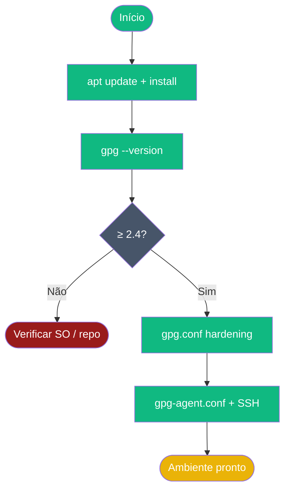

# Playbook 01 — Ambiente GPG

**Objetivo:** Instalar e configurar GPG + ferramentas auxiliares no Ubuntu 24.04  
**Tempo:** ~20 min  
**Pré-requisitos:** Ubuntu 24.04 LTS · acesso sudo  

---

## Visão geral do processo



---

## Passo 1 — Atualizar repositórios

```sh
sudo apt update
```

## Passo 2 — Instalar pacotes

```sh
sudo apt install -y gnupg2 rng-tools age cryptsetup pinentry-tty wget curl git
sudo apt install -y vim qrencode zbar-tools bc
```

## Passo 3 — Verificar versão GPG

```sh
gpg --version | head -n1
age --version
```

**Saída esperada:** `gpg (GnuPG) 2.4.x` · `age v1.x`

## Passo 4 — Verificar entropia

```sh
cat /proc/sys/kernel/random/entropy_avail
```

**Saída esperada:** valor > 1000

## Passo 5 — NTP sincronizado

```sh
sudo timedatectl set-ntp true
sudo systemctl restart systemd-timesyncd 2>/dev/null || true
timedatectl status | grep "synchronized"
```

## Passo 6 — Criar diretório .gnupg com permissão correta

```sh
mkdir -p ~/.gnupg
chmod 700 ~/.gnupg
ls -ld ~/.gnupg
```

**Saída esperada:** `drwx------ ... ~/.gnupg`

## Passo 7 — Hardening do gpg.conf

```sh
cat > ~/.gnupg/gpg.conf << 'EOF'
personal-cipher-preferences AES256 AES192 AES
personal-digest-preferences SHA512 SHA384 SHA256
cert-digest-algo SHA512
default-preference-list SHA512 SHA384 SHA256 AES256 AES192 AES ZLIB BZIP2 ZIP
s2k-cipher-algo AES256
s2k-digest-algo SHA512
s2k-count 65011712
no-emit-version
no-comments
export-options export-minimal
require-cross-certification
keyid-format long
with-fingerprint
with-subkey-fingerprint
disable-cipher-algo 3DES
disable-cipher-algo IDEA
disable-cipher-algo CAST5
EOF

chmod 600 ~/.gnupg/gpg.conf
```

## Passo 8 — Hardening do gpg-agent.conf

```sh
cat > ~/.gnupg/gpg-agent.conf << 'EOF'
default-cache-ttl 3600
max-cache-ttl 7200
enable-ssh-support
EOF

chmod 600 ~/.gnupg/gpg-agent.conf
gpgconf --kill gpg-agent && gpgconf --launch gpg-agent
```

## Passo 9 — Verificar agente

```sh
gpgconf --list-dirs agent-socket
gpgconf --check-programs
```

---

## ✅ Concluído

```sh
gpg --version | head -n1
cat ~/.gnupg/gpg.conf | grep "no-emit-version"
cat ~/.gnupg/gpg-agent.conf | grep "enable-ssh-support"
```

Todos os três comandos devem retornar sem erro.

---

📖 **Referência:** [COMANDO 0.2–0.8](../🎓%20OpenPGP-GPG%20do%20Zero%20ao%20Expert%20-%20Versão%201.0.md#-comando-02-atualizar-o-sistema) · [README dos scripts](../scripts/README.md)
