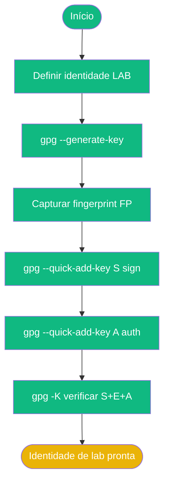

# Playbook 02 — Primeira Chave GPG

**Objetivo:** Criar identidade de laboratório + chave mestra + subchaves [S][E][A]  
**Tempo:** ~25 min  
**Pré-requisitos:** Playbook 01 concluído  

---

## Visão geral do processo



---

## Passo 1 — Definir variáveis de laboratório

```sh
NOME_LAB="Aluno Lab"
EMAIL_LAB="aluno.training@openpgp-lab.local"
COMENTARIO_LAB="TRAINING 2026"

echo "UID: $NOME_LAB ($COMENTARIO_LAB) <$EMAIL_LAB>"
```

> 🔴 **Regra:** nunca use e-mail pessoal ou de produção nos exercícios.

## Passo 2 — Gerar chave mestra [C] com subchave [E] automática

```sh
gpg --generate-key
```

Quando solicitado:
- **Nome:** `Aluno Lab`
- **E-mail:** `aluno.training@openpgp-lab.local`
- Confirme com `O` (OK)
- Digite e confirme a passphrase

**Saída esperada:** `gpg: key XXXXXXXXXXXXXXXX marked as ultimately trusted`

## Passo 3 — Capturar fingerprint

```sh
FP=$(gpg --list-secret-keys --with-colons "aluno.training@openpgp-lab.local" \
  | awk -F: '/^fpr:/ {print $10; exit}')
echo "FP=$FP"
```

> ✅ Anote o fingerprint — você vai usá-lo em todos os próximos playbooks.

## Passo 4 — Listar chave (confirmar [C][E])

```sh
gpg --list-keys --keyid-format long
gpg --fingerprint "aluno.training@openpgp-lab.local"
```

## Passo 5 — Adicionar subchave de assinatura [S]

```sh
gpg --quick-add-key "$FP" ed25519 sign 1y
```

## Passo 6 — Adicionar subchave de autenticação [A]

```sh
gpg --quick-add-key "$FP" ed25519 auth 1y
```

## Passo 7 — Verificar as 3 subchaves [S][E][A]

```sh
gpg -K --with-subkey-fingerprints --keyid-format long
```

**Saída esperada:** linhas com `[S]`, `[E]`, `[A]` listadas abaixo da mestra `[C]`.

## Passo 8 — Exportar variável FP para a sessão atual

```sh
echo "export FP=\"$FP\"" >> ~/.bashrc
source ~/.bashrc
echo "FP=$FP"
```

---

## ✅ Concluído

```sh
# Confirma: mestra [C] + três subchaves [S][E][A]
gpg -K --with-colons "$FP" | grep "^ssb:" | awk -F: '{print $12}' | sort | tr '\n' ' '
# Saída esperada (qualquer ordem): a e s
```

---

📖 **Referência:** [COMANDO 0.6](../🎓%20OpenPGP-GPG%20do%20Zero%20ao%20Expert%20-%20Versão%201.0.md#comando-0-6-lab-ztc) · [COMANDO 1.1–1.4](../🎓%20OpenPGP-GPG%20do%20Zero%20ao%20Expert%20-%20Versão%201.0.md#-comando-11-criando-seu-par-de-chaves)
