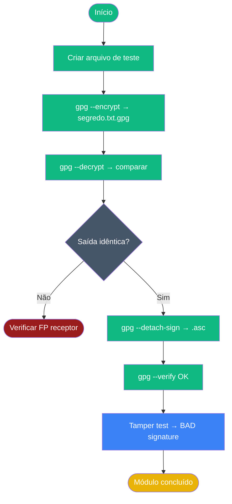

# Playbook 03 — Cifrar, Assinar e Verificar

**Objetivo:** Cifrar arquivo, decifrar, assinar detached e verificar integridade  
**Tempo:** ~20 min  
**Pré-requisitos:** Playbook 02 concluído · variável `$FP` definida  

---

## Visão geral do processo



---

## Passo 1 — Criar arquivo de teste

```sh
echo "Mensagem confidencial de laboratório — texto de exemplo (não é senha real)." > segredo.txt
cat segredo.txt
```

## Passo 2 — Cifrar

```sh
gpg --encrypt --recipient "aluno.training@openpgp-lab.local" segredo.txt
ls -lh segredo.txt.gpg
```

**Saída esperada:** arquivo `segredo.txt.gpg` criado.

## Passo 3 — Decifrar

```sh
gpg --decrypt segredo.txt.gpg
```

**Saída esperada:** texto original exibido no terminal. GPG pede passphrase.

## Passo 4 — Decifrar para arquivo e comparar

```sh
gpg --decrypt segredo.txt.gpg > segredo-recriado.txt
diff segredo.txt segredo-recriado.txt && echo "✅ Idênticos" || echo "❌ Diferença detectada"
```

**Saída esperada:** `✅ Idênticos` (sem linhas de diff)

## Passo 5 — Assinar detached (arquivo separado)

```sh
echo "Eu, Aluno Lab, concluí o Módulo 2" > declaracao.txt
gpg --detach-sign --armor declaracao.txt
ls declaracao.txt declaracao.txt.asc
```

## Passo 6 — Verificar assinatura

```sh
gpg --verify declaracao.txt.asc declaracao.txt
```

**Saída esperada:** `Good signature from "Aluno Lab ..."`

## Passo 7 — Teste de adulteração (deve falhar)

```sh
echo "Texto alterado!" >> declaracao.txt
gpg --verify declaracao.txt.asc declaracao.txt
```

**Saída esperada:** `BAD signature` — confirma que a assinatura detectou alteração.

## Passo 8 — Restaurar arquivo original

```sh
# Remove a linha extra adicionada no passo 7
head -1 declaracao.txt > declaracao-ok.txt
mv declaracao-ok.txt declaracao.txt
gpg --verify declaracao.txt.asc declaracao.txt
```

**Saída esperada:** `Good signature` de volta.

---

## ✅ Concluído

```sh
# Smoke test completo: cifra → decifra → compara
echo "smoke-$(date +%s)" > /tmp/opg-smoke.txt
gpg --encrypt --recipient "aluno.training@openpgp-lab.local" /tmp/opg-smoke.txt
gpg --decrypt /tmp/opg-smoke.txt.gpg | diff - /tmp/opg-smoke.txt && echo "✅ OK" || echo "❌ FAIL"
```

---

📖 **Referência:** [COMANDO 2.1–2.5](../🎓%20OpenPGP-GPG%20do%20Zero%20ao%20Expert%20-%20Versão%201.0.md#-comando-21-criar-arquivo-de-teste)
