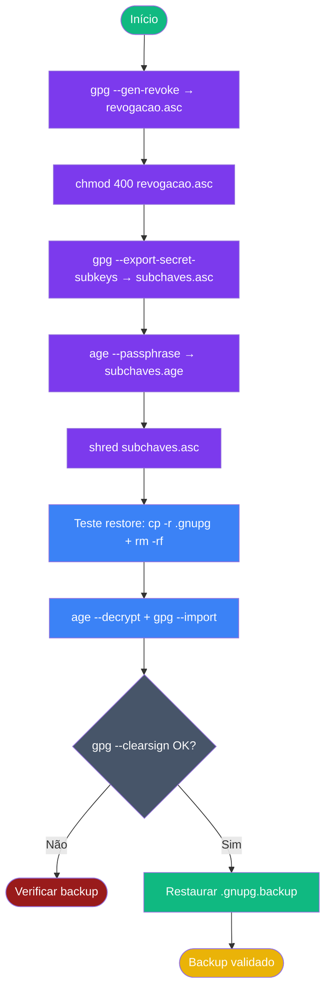

# Playbook 04 — Backup e Revogação

**Objetivo:** Gerar certificado de revogação · backup cifrado com age · teste de restore  
**Tempo:** ~30 min  
**Pré-requisitos:** Playbook 02 concluído · variável `$FP` definida · `age` instalado  

---

## Visão geral do processo



---

## Passo 1 — Gerar certificado de revogação

```sh
LAB_EMAIL="aluno.training@openpgp-lab.local"
FP=$(gpg --list-secret-keys --with-colons "$LAB_EMAIL" | awk -F: '/^fpr:/ {print $10; exit}')

gpg --output "revogacao-mestra-$(date +%Y%m%d).asc" \
    --generate-revocation "$FP"
```

Quando solicitado:
- Motivo: `1` (Key has been compromised) para fins de lab
- Descrição: deixe em branco e confirme
- Confirme `y`

## Passo 2 — Proteger certificado de revogação

```sh
mkdir -p ~/secure-backup/offline
cp revogacao-*.asc ~/secure-backup/offline/
chmod 400 ~/secure-backup/offline/revogacao-*.asc
ls -lh ~/secure-backup/offline/
```

## Passo 3 — Exportar subchaves secretas

```sh
gpg --export-secret-subkeys --armor "$FP" > subchaves.asc
wc -c subchaves.asc
```

> ⚠️ `subchaves.asc` contém material privado — não deixar no disco por mais de 60s.

## Passo 4 — Cifrar backup com age

```sh
age --passphrase --output subchaves.age subchaves.asc
ls -lh subchaves.age
```

Use uma passphrase forte (mínimo 20 caracteres ou Diceware 6 palavras).

## Passo 5 — Destruir arquivo em claro

```sh
shred -u subchaves.asc
ls subchaves.asc 2>/dev/null && echo "❌ arquivo ainda existe" || echo "✅ destruído"
```

## Passo 6 — Mover backup para local seguro

```sh
mv subchaves.age ~/secure-backup/
ls -lh ~/secure-backup/subchaves.age
```

## Passo 7 — Teste de restore (simula desastre)

```sh
# Backup do estado atual
cp -r ~/.gnupg ~/.gnupg.backup

# Simula perda total
rm -rf ~/.gnupg ~/.cache/gpg*

# Confirma que não há chaves
gpg -K 2>&1 | head -3
```

## Passo 8 — Restaurar do backup

```sh
# Decifra o backup
age --decrypt --output subchaves-restauradas.asc ~/secure-backup/subchaves.age

# Importa
gpg --import subchaves-restauradas.asc

# Limpa arquivo decifrado
shred -u subchaves-restauradas.asc
```

## Passo 9 — Verificar restauração

```sh
echo "restore-$(date +%s)" | gpg --clearsign > /dev/null 2>&1 \
  && echo "✅ Restauração OK" \
  || echo "❌ Falha — verificar passphrase ou arquivo"
```

## Passo 10 — Restaurar ambiente de lab

```sh
rm -rf ~/.gnupg
cp -r ~/.gnupg.backup ~/.gnupg
gpg -K | head -5
```

**Saída esperada:** chaves de lab listadas novamente.

---

## ✅ Concluído

```sh
# Confirma: revogação protegida + backup age + chaves de volta
ls -lh ~/secure-backup/offline/revogacao-*.asc
ls -lh ~/secure-backup/subchaves.age
gpg -K | grep "Aluno Lab"
```

---

📖 **Referência:** [COMANDO 3.1–3.5](../🎓%20OpenPGP-GPG%20do%20Zero%20ao%20Expert%20-%20Versão%201.0.md#-comando-31-certificado-de-revogação-obrigatório)
