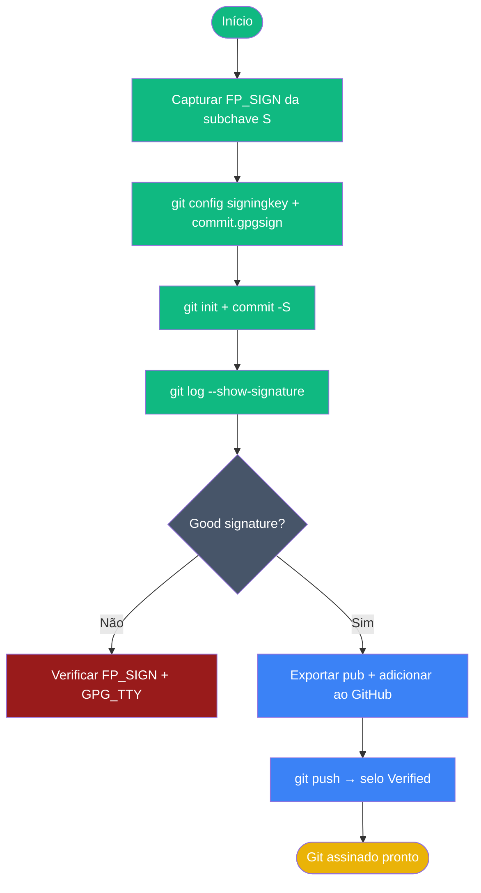

# Playbook 05 — Git com Commits Assinados

**Objetivo:** Configurar Git para assinar commits e tags com subchave [S]  
**Tempo:** ~20 min  
**Pré-requisitos:** Playbook 02 concluído · Git instalado · variável `$FP` definida  

---

## Visão geral do processo



---

## Passo 1 — Capturar fingerprint da subchave [S]

```sh
FP_SIGN=$(gpg --list-keys --with-colons "$FP" \
  | awk -F: '/^sub:/ { want = ($0 ~ /:s:/) } /^fpr:/ && want { print $10; exit }')
echo "✅ FP_SIGN=$FP_SIGN"
```

Se `FP_SIGN` ficar vazio:

```sh
# Alternativa manual: localizar [S] na listagem
gpg -K --with-subkey-fingerprints --keyid-format long
# Copiar o fingerprint da linha abaixo de "ssb ... [S]"
```

## Passo 2 — Configurar Git

```sh
git config --global user.signingkey "$FP_SIGN"
git config --global commit.gpgsign true
git config --global gpg.program "$(which gpg)"
git config --global user.name "Aluno Lab"
git config --global user.email "aluno.training@openpgp-lab.local"
```

## Passo 3 — Verificar configuração

```sh
git config --global --get user.signingkey
git config --global --get commit.gpgsign
git config --global --get gpg.program
```

Todos os três devem retornar valores definidos.

## Passo 4 — Criar repositório de teste

```sh
mkdir ~/test-gpg-git && cd ~/test-gpg-git
git init
echo "# Teste GPG" > README.md
git add README.md
```

## Passo 5 — Primeiro commit assinado

```sh
git commit -S -m "Primeiro commit assinado com GPG"
```

GPG pedirá a passphrase da subchave [S].

## Passo 6 — Verificar assinatura no log

```sh
git log --show-signature -1
```

**Saída esperada:**
```
gpg: Good signature from "Aluno Lab (TRAINING 2026) ..."
```

## Passo 7 — Exportar chave pública para GitHub/GitLab

```sh
gpg --armor --export "aluno.training@openpgp-lab.local" > ~/gpg-public.asc
cat ~/gpg-public.asc
```

Adicione o conteúdo em **Settings → SSH and GPG keys → New GPG key** no GitHub.

## Passo 8 — Criar tag assinada (opcional, Expert)

```sh
git tag -s v0.1 -m "Primeira tag assinada"
git tag -v v0.1
```

**Saída esperada:** `Good signature from "Aluno Lab ..."`

---

## ✅ Concluído

```sh
cd ~/test-gpg-git
git log --show-signature -1 | grep -E "Good signature|commit"
```

Deve aparecer `Good signature from "Aluno Lab"`.

---

## Troubleshooting rápido

| Sintoma | Correção |
|---------|----------|
| `gpg failed to sign the data` | `export GPG_TTY=$(tty)` → tentar de novo |
| `Commit sem assinatura` | `git config --global commit.gpgsign true` |
| `FP_SIGN vazio` | Confirmar que subchave [S] existe: `gpg -K` |
| `Pinentry não abre` | `echo $GPG_TTY` vazio → `export GPG_TTY=$(tty)` |

---

📖 **Referência:** [COMANDO 4.1–4.3](../🎓%20OpenPGP-GPG%20do%20Zero%20ao%20Expert%20-%20Versão%201.0.md#-comando-41-configurando-o-git)
