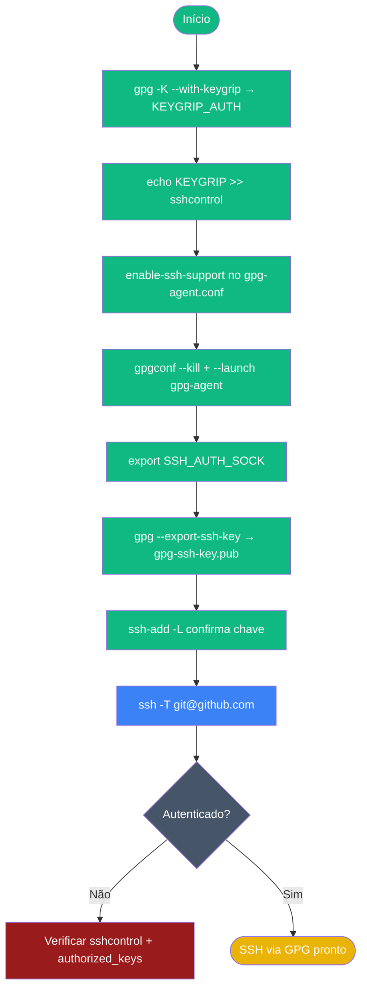

# Playbook 06 — SSH via gpg-agent

**Objetivo:** Substituir chave SSH tradicional pela subchave [A] do GPG  
**Tempo:** ~25 min  
**Pré-requisitos:** Playbook 02 concluído · variável `$FP` definida  

---

## Visão geral do processo



---

## Passo 1 — Encontrar keygrip da subchave [A]

```sh
gpg -K --with-keygrip "$FP" | grep -A2 "\[A\]"
```

**Saída esperada:**
```
ssb   ed25519 2026-xx-xx [A] [expires: 2027-xx-xx]
      Keygrip = 4E8C7F9A2B3C5D1E6F8A9B0C1D2E3F4A5B6C7D8E
```

## Passo 2 — Capturar keygrip automaticamente

```sh
KEYGRIP_AUTH=$(gpg --list-secret-keys --with-colons "$FP" | awk -F: '
/^ssb:/ { want = ($0 ~ /:a:/) }
/^grp:/ && want {
  for (i = 1; i <= NF; i++)
    if ($i ~ /^[0-9A-Fa-f]{40}$/) { print $i; exit }
}')
echo "KEYGRIP_AUTH=$KEYGRIP_AUTH"
```

## Passo 3 — Adicionar keygrip ao sshcontrol

```sh
# Evita duplicata
grep -qF "$KEYGRIP_AUTH" ~/.gnupg/sshcontrol 2>/dev/null \
  || echo "$KEYGRIP_AUTH" >> ~/.gnupg/sshcontrol

cat ~/.gnupg/sshcontrol
```

## Passo 4 — Habilitar SSH no gpg-agent.conf

```sh
if ! grep -q "enable-ssh-support" ~/.gnupg/gpg-agent.conf 2>/dev/null; then
  echo "enable-ssh-support" >> ~/.gnupg/gpg-agent.conf
fi
grep "enable-ssh-support" ~/.gnupg/gpg-agent.conf
```

## Passo 5 — Reiniciar gpg-agent

```sh
gpgconf --kill gpg-agent
gpgconf --launch gpg-agent
ls -la ~/.gnupg/S.gpg-agent.ssh
```

**Saída esperada:** socket `S.gpg-agent.ssh` listado.

## Passo 6 — Configurar SSH_AUTH_SOCK

```sh
if ! grep -q "SSH_AUTH_SOCK" ~/.bashrc 2>/dev/null; then
  echo 'export SSH_AUTH_SOCK=$(gpgconf --list-dirs agent-ssh-socket)' >> ~/.bashrc
fi
export SSH_AUTH_SOCK=$(gpgconf --list-dirs agent-ssh-socket)
echo "SSH_AUTH_SOCK=$SSH_AUTH_SOCK"
```

## Passo 7 — Exportar chave pública SSH

```sh
gpg --export-ssh-key "$FP" > gpg-ssh-key.pub
cat gpg-ssh-key.pub
```

**Saída esperada:** linha começando com `ssh-ed25519 AAAA...`

## Passo 8 — Verificar que o agente reconhece a chave

```sh
ssh-add -L
```

**Saída esperada:** mesma chave listada do `gpg-ssh-key.pub`.

## Passo 9 — Adicionar ao servidor (ou GitHub)

```sh
# Adicionar ao authorized_keys local para teste
cat gpg-ssh-key.pub >> ~/.ssh/authorized_keys
chmod 600 ~/.ssh/authorized_keys
```

Para GitHub: cole o conteúdo de `gpg-ssh-key.pub` em **Settings → SSH keys**.

## Passo 10 — Testar conexão

```sh
# Testar com GitHub (se a chave foi adicionada)
ssh -T git@github.com
```

**Saída esperada:** `Hi USER! You've successfully authenticated...`

---

## ✅ Concluído

```sh
ssh-add -L | grep "openpgp:" && echo "✅ Subchave [A] visível no agente SSH"
cat ~/.gnupg/sshcontrol
grep "enable-ssh-support" ~/.gnupg/gpg-agent.conf
```

---

## Troubleshooting rápido

| Sintoma | Correção |
|---------|----------|
| `ssh-add -L` vazio | Keygrip não está no `sshcontrol`; refazer Passo 3 |
| `Agent refused operation` | `gpgconf --kill gpg-agent && gpgconf --launch gpg-agent` |
| `Permission denied (publickey)` | Chave pública não está no `authorized_keys` do servidor |

---

📖 **Referência:** [COMANDO 5.1–5.6](../🎓%20OpenPGP-GPG%20do%20Zero%20ao%20Expert%20-%20Versão%201.0.md#-comando-51-encontrando-o-keygrip-da-subchave-a)
