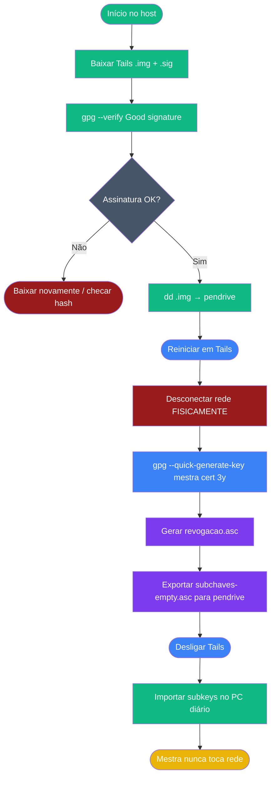

# Playbook 07 — Tails + Chave Mestra Offline

**Objetivo:** Gravar pendrive Tails · gerar mestra [C] air-gapped · exportar subchaves para PC  
**Tempo:** ~60 min  
**Pré-requisitos:** Pendrive ≥ 8 GB · acesso sudo no host · Playbook 01 concluído  

---

## Visão geral do processo



---

## PARTE A — No host com internet

### Passo 1 — Definir versão e baixar imagem USB

```sh
# Confira a versão atual em: https://tails.net/install/download/index.en.html
TAILS_VER="7.7.1"
TAILS_IMG="tails-amd64-${TAILS_VER}.img"
TAILS_SIG="${TAILS_IMG}.sig"

wget "https://download.tails.net/tails/stable/tails-amd64-${TAILS_VER}/${TAILS_IMG}"
```

### Passo 2 — Baixar assinatura e chave do projeto

```sh
wget "https://tails.net/torrents/files/${TAILS_SIG}"
wget https://tails.net/tails-signing.key
gpg --import tails-signing.key
```

### Passo 3 — Verificar imagem

```sh
gpg --verify "$TAILS_SIG" "$TAILS_IMG"
```

**Saída esperada:** `Good signature from "Tails developers ..."`  
Aviso de confiança na chave é normal no primeiro uso — não invalida a assinatura.

### Passo 4 — Identificar pendrive (CRÍTICO)

```sh
lsblk -p | grep "disk"
# Ex.: /dev/sda (HD principal — NUNCA TOQUE)
#       /dev/sdb (pendrive — é este)
```

### Passo 5 — Gravar imagem no pendrive

```sh
read -p "CAMINHO DO PENDRIVE (ex: /dev/sdb): " PENDRIVE
read -p "Confirma $PENDRIVE? (digite SIM): " CONFIRMA
if [ "$CONFIRMA" != "SIM" ]; then echo "Cancelado."; exit 1; fi

sudo dd if="$TAILS_IMG" of=$PENDRIVE bs=4M status=progress
sync
echo "✅ Pendrive Tails criado!"
```

---

## PARTE B — Dentro do Tails (OFFLINE)

> 🔴 **Antes de qualquer comando nesta parte:** desconecte o cabo de rede ou desative o WiFi na BIOS/UEFI.

### Passo 6 — Verificar que rede está desligada

```sh
nmcli networking off
# ou confirmar que nenhuma interface tem endereço IP
ip addr | grep "inet "
```

### Passo 7 — Definir UID da mestra

```sh
UID_MASTER="Seu Nome Real (OFFLINE MASTER) <seu@email.com>"
```

> ⚠️ Use seu nome e e-mail reais aqui — esta é a identidade de produção.  
> Para laboratório: `UID_MASTER="Aluno Lab (OFFLINE MASTER) <aluno.training@openpgp-lab.local>"`

### Passo 8 — Gerar chave mestra [C]

```sh
gpg --quick-generate-key "$UID_MASTER" ed25519 cert 3y
```

### Passo 9 — Capturar fingerprint

```sh
FP_MASTER=$(gpg --list-secret-keys --with-colons "$UID_MASTER" \
  | awk -F: '/^fpr:/ {print $10; exit}')
echo "Fingerprint: $FP_MASTER"
# ANOTE EM PAPEL — nunca só no computador
```

### Passo 10 — Gerar certificado de revogação

```sh
gpg --output "/live/persistence/TailsData_unlocked/revogacao.asc" \
    --generate-revocation "$FP_MASTER"
```

### Passo 11 — Backup da mestra (pendrive LUKS separado)

```sh
gpg --export-secret-keys --armor "$FP_MASTER" \
  > "/live/persistence/TailsData_unlocked/master-key.asc"
```

> Para produção: copiar `master-key.asc` para pendrive LUKS externo, **não** deixar na persistência do Tails permanentemente.

### Passo 12 — Exportar subchaves para o PC

```sh
gpg --export-secret-subkeys --armor "$FP_MASTER" \
  > "/live/persistence/TailsData_unlocked/subkeys-empty.asc"
```

### Passo 13 — Checklist antes de desligar

```sh
gpg -K --with-subkey-fingerprints --keyid-format long
ls -lh /live/persistence/TailsData_unlocked/
sync
```

Confirmar: `revogacao.asc` · `master-key.asc` · `subkeys-empty.asc` existem.

### Passo 14 — Desligar Tails

```sh
poweroff
```

---

## PARTE C — De volta ao PC diário

### Passo 15 — Importar subchaves (do pendrive)

```sh
# Monte o pendrive com as subchaves exportadas
gpg --import /media/pendrive/subkeys-empty.asc
```

### Passo 16 — Verificar: mestra NÃO está no PC

```sh
gpg -K | head -20
```

**Saída esperada:** `sec>` ou `sec#` — sinal de que a mestra está no cartão ou ausente.  
**NÃO deve aparecer:** `sec` (sem `>` ou `#`) com subchaves [S][E][A] — isso indicaria mestra no disco.

---

## ✅ Concluído

```sh
# No PC diário: apenas subchaves operacionais
gpg -K | grep -E "sec[>#]|ssb"
# Deve mostrar sec> ou sec# (nunca sec puro com subkeys)
```

---

📖 **Referência:** [COMANDO 6.1–6.4](../🎓%20OpenPGP-GPG%20do%20Zero%20ao%20Expert%20-%20Versão%201.0.md#comando-6-1-tails-ztc) · [Módulo 6](../🎓%20OpenPGP-GPG%20do%20Zero%20ao%20Expert%20-%20Versão%201.0.md#-módulo-6-tails-e-chave-mestra-offline)
