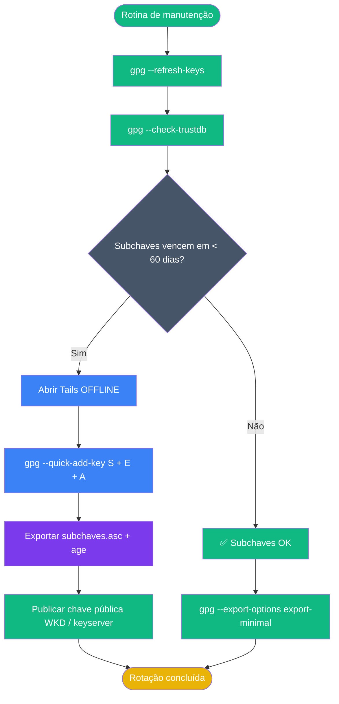

# Playbook 09 — Manutenção e Rotação

**Objetivo:** Atualizar chaves, rotacionar subchaves antes do vencimento, publicar via WKD  
**Tempo:** ~20 min (rotina semanal/mensal/trimestral)  
**Pré-requisitos:** Playbook 02 concluído · variável `$FP` definida  

---

## Visão geral do processo



---

## ROTINA SEMANAL

### Passo 1 — Atualizar chaves do chaveiro

```sh
gpg --refresh-keys
```

Se `dirmngr` indicar ausência de keyserver:

```sh
gpg --keyserver hkps://keys.openpgp.org --refresh-keys
```

### Passo 2 — Verificar subchave de encrypt

```sh
FP=$(gpg --list-secret-keys --with-colons "aluno.training@openpgp-lab.local" \
  | awk -F: '/^fpr:/ {print $10; exit}')
gpg --export "$FP" | gpg --list-packets 2>/dev/null | grep -i "cv25519" \
  && echo "✅ cv25519 OK" || echo "⚠ Verificar subchave [E]"
```

---

## ROTINA MENSAL

### Passo 3 — Verificar trustdb

```sh
gpg --check-trustdb
```

### Passo 4 — Checar dias até vencimento das subchaves

```sh
EXPIRY=$(gpg --list-keys --with-colons "$FP" | awk -F: '
/^sub:/ && $2 != "r" && $7 ~ /^[0-9]+$/ {
    if (min == "" || ($7 + 0) < (min + 0)) min = $7
}
END { if (min != "") print min }')

if [ -n "$EXPIRY" ]; then
  DAYS_LEFT=$(( (EXPIRY - $(date +%s)) / 86400 ))
  echo "Dias até vencimento mais próximo: $DAYS_LEFT"
  [ "$DAYS_LEFT" -lt 60 ] && echo "⚠ ROTAÇÃO NECESSÁRIA" || echo "✅ OK"
fi
```

---

## ROTAÇÃO DE SUBCHAVES (quando < 60 dias)

> ⚠️ Rotação de subchaves exige acesso à **chave mestra** — faça no **Tails offline**.  
> No laboratório com identidade fictícia: pode fazer no PC normalmente.

### Passo 5 — Criar novas subchaves

```sh
# No Tails (produção) ou no PC com identidade de lab:
gpg --quick-add-key "$FP" ed25519 sign 1y
gpg --quick-add-key "$FP" cv25519 encr 1y
gpg --quick-add-key "$FP" ed25519 auth 1y
```

### Passo 6 — Verificar novas subchaves

```sh
gpg -K --with-subkey-fingerprints "$FP"
```

Deve listar as novas subchaves [S][E][A] com datas futuras.

### Passo 7 — Novo backup das subchaves

```sh
gpg --export-secret-subkeys --armor "$FP" > subchaves-novo.asc
age --passphrase --output subchaves-novo.age subchaves-novo.asc
shred -u subchaves-novo.asc
mv subchaves-novo.age ~/secure-backup/subchaves-$(date +%Y%m%d).age
ls ~/secure-backup/subchaves-*.age
```

---

## PUBLICAÇÃO (COMANDO 10.4–10.6)

### Passo 8 — Exportar chave pública minimal

```sh
gpg --export --armor --export-options export-minimal "$FP" > chave-publica.asc
ls -lh chave-publica.asc
```

### Passo 9 — Publicar no keyserver HKPS

```sh
gpg --keyserver hkps://keys.openpgp.org --send-keys "$FP" 2>/dev/null \
  || echo "⚠ Publicar manualmente ou usar WKD"
```

### Passo 10 — WKD no seu domínio

```sh
sudo apt install -y gpg-wks-client

# Gerar hash WKD do seu e-mail
gpg-wks-client --print-wkd-hash "voce@seudominio.example"
# Saída: <hash-z-base32>   voce@seudominio.example

# Exportar arquivo com nome = hash
FP_PUB="$FP"
H="$(gpg-wks-client --print-wkd-hash "voce@seudominio.example" | awk '{print $1; exit}')"
install -d -m 0755 hu
gpg --export --export-options export-minimal "$FP_PUB" > "hu/$H"

# Copiar hu/ para /.well-known/openpgpkey/ no servidor web
# ls hu/
```

### Passo 11 — Testar WKD

```sh
# Em outra máquina ou GNUPGHOME limpo:
gpg-wks-client --check "voce@seudominio.example"
gpg --auto-key-locate=wkd --locate-keys "voce@seudominio.example"
```

---

## CRON — automatizar rotinas

```sh
# Editar crontab
crontab -e

# Backup diário às 2h
0 2 * * * gpg --export-secret-subkeys --armor "aluno.training@openpgp-lab.local" | age --passphrase >> /dev/null

# Verificação de expiração semanal (domingo 3h)
0 3 * * 0 /home/aluno/scripts/rotate-subkeys.sh >> /home/aluno/logs/gpg-rotate.log 2>&1

# Health check diário às 4h
0 4 * * * /home/aluno/scripts/gpg-health-check.sh >> /home/aluno/logs/gpg-health.log 2>&1
```

---

## Calendário de referência

| Frequência | Ação | Comando |
|-----------|------|---------|
| Semanal | Atualizar chaveiro | `gpg --refresh-keys` |
| Mensal | Verificar trustdb + simulate restore | `gpg --check-trustdb` |
| Trimestral | Checar vencimento subchaves | Script de expiração (Passo 4) |
| Anual | Auditoria completa + rotação | Tails offline + novos backups |

---

## Aliases úteis (`~/.bashrc`)

```sh
alias gpg-ls='gpg --list-keys --keyid-format long --with-subkey-fingerprints'
alias gpg-ls-sec='gpg -K --keyid-format long --with-keygrip --with-subkey-fingerprints'
alias gpg-fp='gpg --fingerprint --with-subkey-fingerprints'
alias gpg-agent-reset='gpgconf --kill gpg-agent && gpgconf --launch gpg-agent'
```

---

## ✅ Concluído

```sh
gpg --refresh-keys 2>&1 | tail -5
gpg --check-trustdb && echo "✅ trustdb OK"
gpg -K | grep "Aluno Lab"
```

---

📖 **Referência:** [COMANDO 10.1–10.6](../🎓%20OpenPGP-GPG%20do%20Zero%20ao%20Expert%20-%20Versão%201.0.md#comando-10-1) · [Módulo 10](../🎓%20OpenPGP-GPG%20do%20Zero%20ao%20Expert%20-%20Versão%201.0.md#modulo-10-ztc) · [Módulo 8 — Automação](../🎓%20OpenPGP-GPG%20do%20Zero%20ao%20Expert%20-%20Versão%201.0.md#-módulo-8-automação-scripts-evolutivos)
