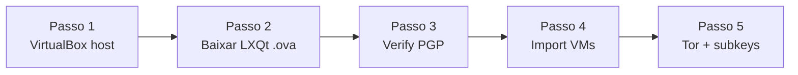

# Whonix capstone — VirtualBox + Gateway/Workstation

**Objetivo:** Instalar VirtualBox verificado, baixar Whonix **18.x LXQt**, verificar PGP com `derivative.asc`, importar VMs e confirmar Tor — ambiente para usar subkeys GPG importadas do Tails (Módulo 6–7).  
**Tempo:** ~60 min  
**Pré-requisitos:**
- [ ] Playbooks **01–07** concluídos (GPG + Tails + subkeys exportadas)
- [ ] Host Debian amd64, 16 GB RAM recomendado, VT-x/AMD-V
- [ ] Tor Browser no host para download do `.ova`

> Scripts **autocontidos** deste repositório (`pgp-whonix-*`) — prefixo `pgp-`, sem dependência de outros cursos VIPs-com.

---

## Visão geral



---

## Passo 1 — VirtualBox (host Debian)

```bash
cd scripts
chmod +x pgp-whonix-*.sh
sudo ./pgp-whonix-install-virtualbox.sh -e -y
```

Windows/macOS: instalador oficial em virtualbox.org + Extension Pack (mesma versão).

---

## Passo 2 — Baixar imagens

De https://www.whonix.org/wiki/Download:

| Arquivo | Nota |
| --- | --- |
| `Whonix-LXQt-<versão>.Intel_AMD64.ova` | GUI atual (LXQt) |
| `.ova.asc` | Assinatura |
| `derivative.asc` | https://www.whonix.org/keys/derivative.asc |

---

## Passo 3 — Verificar assinatura (OBRIGATÓRIO)

Fingerprint **sempre** de https://www.whonix.org/wiki/Verify_the_images:

```bash
./pgp-whonix-verify-image.sh \
  -i /caminho/Whonix-LXQt-VERSAO.Intel_AMD64.ova \
  -s /caminho/Whonix-LXQt-VERSAO.Intel_AMD64.ova.asc \
  -f "FINGERPRINT_DA_PAGINA_OFICIAL"
```

---

## Passo 4 — Importar

```bash
sudo ./pgp-whonix-import-ova.sh \
  -i /caminho/Whonix-LXQt-VERSAO.Intel_AMD64.ova \
  -s /caminho/Whonix-LXQt-VERSAO.Intel_AMD64.ova.asc \
  -k /caminho/derivative.asc \
  -f "FINGERPRINT_DA_PAGINA_OFICIAL" \
  -t lxqt -b
```

Ordem de boot: **Gateway primeiro**, depois Workstation.

---

## Passo 5 — Confirmar Tor e identidade GPG

Na **Workstation** (copie o script para a VM):

```bash
./pgp-whonix-verificar-tor.sh
passwd   # trocar changeme (Gateway também)
```

Importe as **subkeys** exportadas no playbook [07-tails-chave-mestra.md](./07-tails-chave-mestra.md) — master permanece no Tails air-gap.

---

## ✅ Concluído

- [ ] Good signature antes do import
- [ ] Tor confirmado na Workstation
- [ ] Senhas padrão alteradas
- [ ] Subkeys `[S][E][A]` visíveis com `gpg -K` (master ausente)

📖 **Referência:** Módulo 6–7 do curso · [Verify_the_images](https://www.whonix.org/wiki/Verify_the_images)
